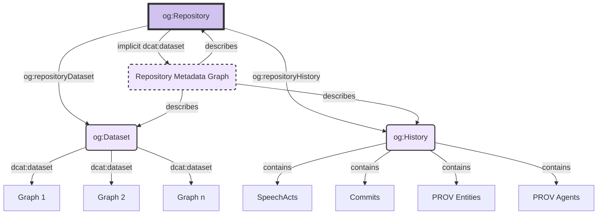
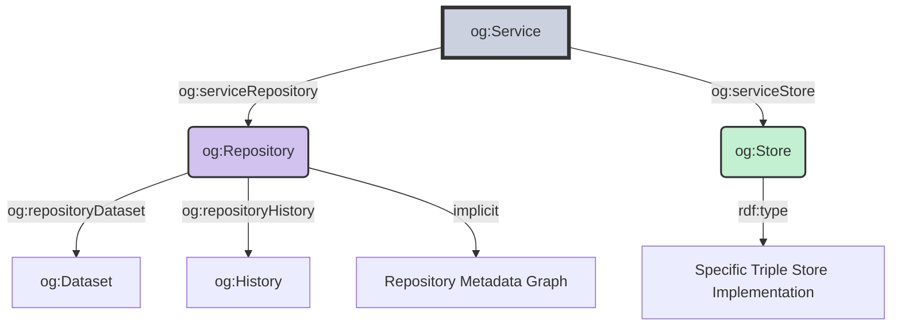

After examining the PROV-based `og:SpeechAct` and `og:Commit` model in the [previous article](/introduction/part-2), we will now focus on the structure of an Ontogen repository.

## Isolated history graph

As we saw in the last article, Ontogen's version history is based on so-called `og:Proposition`s, which are implemented as RDF Triple Compounds. These propositions form the foundation for the Ontogen speech acts and commits, which represent the actual versioning information. A particular challenge in implementing a version control system for RDF is the question of how to store this versioning information in relation to the actual data.

A distinctive feature of storing versioning information in Ontogen is the strict separation between the actual data and the versioning artifacts. Similar to file-based version control systems like Git, where the version history is encapsulated in a hidden `.git` directory, Ontogen stores all versioning information in a separate graph, the so-called `og:History` graph.

This history graph stores the proposition compounds with the RDF-star statements and the assertions of all higher-level resources such as speech acts and commits. This approach ensures that the actual data of the RDF dataset remains completely free of version control artifacts.

The implementation is achieved through the use of RDF-star and the RTC vocabulary. We use the inverse `rtc:elements` property of the `rtc:elementOf` property and store the RDF-star assertions as "unasserted" in the history graph. This means that the actual assertions in the history graph are not restated, but only annotated.

Another advantage of this approach is that we save at least a little storage space: the statements are asserted only once in the graph with the version-controlled user data, while they appear in the history graph merely as quoted triples. This prevents additional duplication that would occur with "asserted" RDF-star annotations, where the statements would need to be stored again as regular RDF triples in the history graph. (Due to the identity properties of propositions, where identical statements coincide, at least some propositions can generally be saved in individual cases when identical statements are repeated in speech acts.)

It should be noted that the current version of Ontogen only supports versioning of individual RDF graphs. Managing changes across different graphs of an RDF dataset is planned for future versions.

## Ontogen repositories as DCAT catalogs

Regardless of the versioning issue, a general question arises: how do we actually manage the datasets that are versioned but free from the versioning history? Of course, we don't want to impose any obligations on the user here. Rather, it's about how exactly we can describe the graphs of our RDF dataset and make their metadata accessible to consumers of our dataset. Moreover, if our dataset consists of a larger number of graphs (when we support this in the future), this can easily become unwieldy and makes further structuring, if not necessary, at least advisable.

According to the standard, RDF datasets are just a default graph and a set of named graphs, and beyond that, they make no further recommendations. There is the [SPARQL Service Description Vocabulary](https://www.w3.org/TR/sparql12-service-description/) that reflects the graph structure of a SPARQL store, but this is primarily designed for technical details of a SPARQL endpoint and offers little room for rich semantic descriptions of the data itself and nested or hierarchical relationships between datasets or graphs.

In fact, there is a general W3C standard for this problem, the [Data Catalog (DCAT) Vocabulary](https://www.w3.org/TR/vocab-dcat-3/), which is suitable for our purposes in many ways:

1. Flexibility and extensibility: DCAT provides a basic vocabulary that can be easily adapted and extended to specific needs.
2. Hierarchical structuring: DCAT allows the modeling of nested catalog structures, which is ideal for organizing complex RDF datasets.
3. Comprehensive metadata: DCAT offers a rich set of properties for describing datasets, including license information, access rights, and temporal aspects, some of which can even be provided automatically in the context of Ontogen, as these can be derived from the speech act and commit history (authors, creation period, data sources, etc.)
4. Support for versioning and integration with PROV: The soon-to-be-completed version 3 of DCAT introduces a comprehensive [versioning concept](https://www.w3.org/TR/vocab-dcat-3/#dataset-versions) that is particularly relevant for Ontogen's use case. This extension also seamlessly integrates the PROV vocabulary, which forms the basis for Ontogen's RDF speech act and commit history. This integration enables the direct derivation and modeling of provenance information and version metadata from the version history. For example, authors, creation dates, and other relevant metadata for specific revisions of a dataset can be automatically generated and presented in a standardized form. This close intertwining of versioning and provenance tracking makes DCAT 3 an ideal vocabulary for metadata description in Ontogen, as it can precisely map the complex temporal and authorial aspects of versioned RDF datasets.
5. Standardization and interoperability: As a W3C standard, DCAT enjoys wide acceptance and support in the data management community. This promotes Ontogen's compatibility with other systems and tools in the field of data management. For example, DCAT has gained great importance in the European Union, where it serves as the basis for DCAT-AP (DCAT Application Profile for data portals in Europe) and is supported in prominent data catalog platforms. The use of DCAT in Ontogen thus allows seamless integration into existing data ecosystems and facilitates the exchange of metadata with a variety of platforms and services.

These properties make DCAT an ideal basis for modeling and describing Ontogen repositories, as it covers both the technical and organizational aspects of RDF data management.

So how do we organize our Ontogen repository with DCAT?

First of all, it should be noted that a dataset in the sense of DCAT is a more general, much broader class than an RDF dataset:

> *"`dcat:Dataset` := A collection of data, published or curated by a single agent, and available for access or download in one or more representations.*
> 
> -- <https://www.w3.org/TR/vocab-dcat-3/#Class:Dataset>

In Ontogen, however, we are dealing with RDF datasets as the subject of versioning, so with a specific subclass. Therefore, we define an `og:Dataset` as a subclass of `dcat:Dataset`. In fact, we can define it even more specifically as a subclass of `dcat:Catalog`, because according to the above broader definition, one can also consider a single graph of an RDF dataset as a `dcat:Dataset` and thus define it as a collection of these.

While `og:Dataset`s are now DCAT catalogs of the pure user-defined graphs of an RDF dataset versioned with Ontogen, we define an `og:Repository` as a DCAT catalog around such an `og:Dataset`, supplementing it with two additional entries, so that an `og:Repository` as a DCAT catalog consists of exactly two explicit DCAT dataset entries and one implicit graph:

1. One entry for the `og:Dataset` DCAT catalog with the pure user-defined graphs (which is defined using the `og:repositoryDataset` property, a sub-property of `dcat:dataset`).
2. One entry for the `og:History` graph with the provenance history of the speech acts and commits as PROV activities, including the linked PROV entities and PROV agents (which is defined using the `og:repositoryHistory` property, a sub-property of `dcat:dataset`).
3. A repository graph that contains the DCAT metadata description of the `og:Repository` itself, including the DCAT metadata description of the `og:Dataset` catalog. This graph poses a particular challenge as it is both part of the repository and its description. This self-referencing leads to a conceptual ambiguity: on the one hand, the graph is a `dcat:Dataset`, on the other hand, it contains the description of the entire repository including itself. In the current DCAT specification, there is no clear solution for this problem of self-description as an explicit part of a `dcat:Catalog`. Therefore, in the current version of Ontogen, this graph is treated implicitly as part of the definition of an `og:Repository`, without an explicit `dcat:dataset` entry for it in the catalog. This solution is pragmatic, but ultimately not really satisfactory. Better suggestions for solving this problem would be very welcome.

## Ontogen instances as DCAT services

Ontogen follows the DCAT model beyond the catalog structure in the implementation of an Ontogen instance. A locally running instance is implemented as a `dcat:DataService`.

> *`dcat:DataService` := "A collection of operations that provides access to one or more datasets or data processing functions."*
> 
> -- <https://www.w3.org/TR/vocab-dcat-3/#Class:Data_Service>

An `og:Service`, which is defined as a subclass of `dcat:DataService`, is a resource that structurally consists of two elements:

1. The `og:Repository` linked via the `dcat:servesDataset` sub-property `og:serviceRepository`
2. An `og:Store` linked via the property `og:serviceStore`, which represents the locally running SPARQL triple store in which the repository is stored

While the same Ontogen repository can exist on different computers, the various Ontogen instances on these computers operate as different Ontogen services with different stores but the same repository.

The main module `Ontogen` is a [GenServer](https://hexdocs.pm/elixir/GenServer.html) over such an `og:Service` as state, which executes the Ontogen operations on the repository specified therein, in the triple store specified therein.

How exactly such an `og:Service` looks and is configured, especially its `og:Store` using triple store vendor-specific subclasses, will be the subject of the following and for the time [last article](/introduction/part-4) in this series. This configuration is done in a special language specifically created for Ontogen, which needs to be introduced first.

## Future developments

In upcoming versions of Ontogen, it is planned to expand the use of the DCAT integration. The interpretation of `og:Dataset` as `dcat:Catalog` is intended to form the basis for supporting versioning of datasets with multiple graphs, where DCAT's capabilities for structuring complex datasets should be utilized.

The implementation of automatic generation of DCAT metadata from the PROV history is also envisioned, which will require developing a concept for dataset revisions in Ontogen based on the versioning concepts in DCAT 3.

These developments aim to enhance Ontogen's compatibility with DCAT standards and provide more comprehensive dataset management features.
