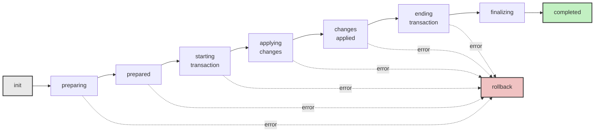
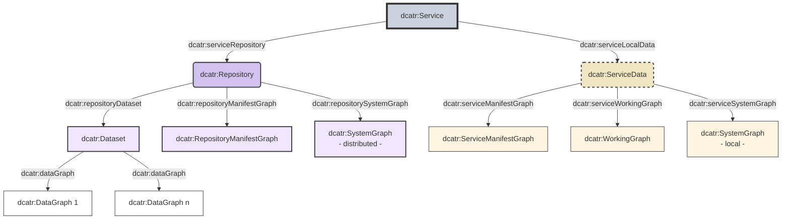
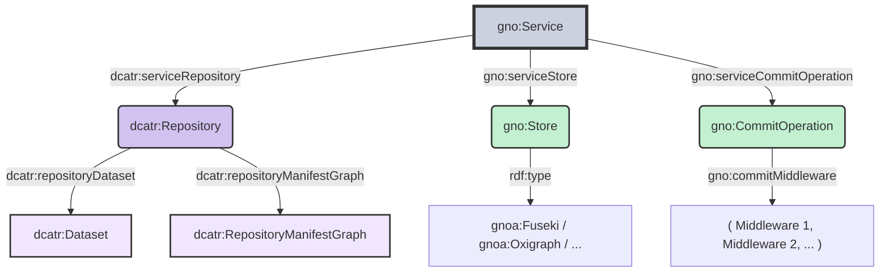

It has been almost a year since the last project update, and a lot has happened behind the scenes. The most substantial part of the current development phase is not finished yet - but in the course of this work, several sub-projects have emerged that are independently useful and ready for release today.

As described in the [previous roadmap update](/roadmap-update-1), the development required extracting and generalizing several foundational components. Today, I am pleased to announce three of these:

1. **Gno** - a library for managing RDF datasets in SPARQL triple stores
2. **DCAT-R** - a specification, vocabulary, and Elixir implementation for describing RDF repositories
3. **RDF.ex 3.0** - with the new `RDF.Data.Source` protocol for polymorphic RDF data access

Each of these grew out of Ontogen's internals but has been designed to stand on its own. In the following sections, I will introduce each project, explain where it comes from, and highlight what is new.


## Gno

[Gno](https://hex.pm/packages/gno) is a library for managing RDF datasets in SPARQL triple stores. The name "Gno" comes from the Greek root for "knowledge" (as in *gnosis*). It provides a unified API that abstracts the differences between storage backends, so you can work with your data the same way regardless of the underlying store. Built-in adapters are available for Apache Jena Fuseki, Oxigraph, QLever, and Ontotext GraphDB, and any other SPARQL 1.1-compatible store can be configured with explicit endpoint URLs. Gno also normalizes behavioral differences between stores - for instance, it transparently handles the divergent default graph semantics (isolated vs. union) across backends.

Readers of the [Repository and Service Model](/introduction/part-3) article will recognize the store-related parts of Gno. That article introduced the `og:Store` concept and the overall service architecture that connects a repository with a storage backend. Gno is, in essence, an extraction of this store adapter system and the surrounding data management operations into an independent library. What was previously only available as part of Ontogen - the store adapter abstraction, the SPARQL operation API, the changeset and configuration system - is now usable on its own, without any dependency on Ontogen's versioning machinery.

Gno covers all standard SPARQL operations - SELECT, ASK, CONSTRUCT, DESCRIBE queries as well as INSERT, DELETE, and graph management operations (CREATE, DROP, CLEAR, COPY, ADD, MOVE). Beyond raw SPARQL, it provides two higher-level systems:

A **changeset system** for expressing structured changes through four actions: *add* (insert new statements), *update* (property-level overwrite), *replace* (subject-level overwrite), and *remove* (delete statements). Before applying changes, a changeset can be converted to an *effective changeset* that queries the current state and computes only the minimal changes actually needed - statements that already exist are not added again, and statements that do not exist are not removed.

### The commit system

The main addition that Gno brings beyond what existed in Ontogen is an extensible commit system. While the store operations and changeset system were extracted largely unchanged, the commit system is a new layer designed from the start to support middleware-based extensibility.

The commit processor implements a state machine that orchestrates the application of changes through well-defined phases:



At each state transition, the configured middleware pipeline is invoked. Middleware components can participate in every phase of the commit lifecycle - they can validate changes before they are applied, enrich the commit with additional metadata, add supplementary changes to other graphs, or perform cleanup after completion. If an error occurs at any point during the transactional phases, the processor automatically rolls back all changes.

Middleware is configured declaratively in the service manifest. For example, to enable commit logging:

```turtle
@prefix gno: <https://w3id.org/gno#> .

<CommitOperation> a gno:CommitOperation
    ; gno:commitMiddleware ( <Logger> )
.

<Logger> a gno:CommitLogger
    ; gno:commitLogLevel "debug"
    ; gno:commitLogChanges true
.
```

This middleware architecture is the primary extension point through which higher-level systems build on Gno. Ontogen, for instance, implements its entire versioning logic - creating commit objects, updating the history graph, advancing the repository HEAD - as Gno commit middleware. This means Ontogen's versioning is not a separate mechanism layered on top; it participates directly in Gno's transactional commit lifecycle, with full rollback support.

For more details, see the [Gno User Guide](https://rdf-elixir.dev/gno-guide/) or its [API documentation](https://hexdocs.pm/gno).


## DCAT-R

The [Repository and Service Model](/introduction/part-3) article introduced the idea of modeling Ontogen repositories as DCAT catalogs and Ontogen instances as DCAT services. The `og:Repository` was defined as a DCAT catalog containing the user dataset and the history graph; the `og:Service` combined a repository with a store backend.

During the subsequent development, this pattern kept recurring. Gno, the store management library introduced above, needed the same kind of structure. So did other projects in the pipeline. In each case, the application was an RDF infrastructure service - providing generic capabilities like store access, versioning, or identity management over RDF datasets - and in each case, the same organizational questions arose: How are graphs organized? Which are user data, which are configuration, which are operational infrastructure?

What these applications share is that they leverage RDF's universality not just for the user data they manage, but also for their own configuration and metadata. The repository description, the service settings, the graph organization - it is all RDF, stored as named graphs alongside the user data. When application structure and user data coexist in the same dataset, the need for principled organization naturally arises.

DCAT-R (Data Catalog Vocabulary for RDF Repositories) addresses this need. It is a [language-independent specification](https://w3id.org/dcatr) of a vocabulary extending the W3C's [Data Catalog Vocabulary (DCAT) 3](https://www.w3.org/TR/vocab-dcat-3/), alongside an Elixir implementation ([DCAT-R.ex](https://hex.pm/packages/dcatr)).

Where DCAT focuses on an external perspective - cataloging datasets for discovery, describing service endpoints for consumers - DCAT-R adds an **intra-service perspective**: vocabulary for how a service organizes its data internally. It models this internal structure using DCAT's own concepts: a repository is a `dcat:Catalog`, each graph is a `dcat:Dataset`, the service remains a `dcat:DataService`. This means existing DCAT tooling can process DCAT-R descriptions without any knowledge of the DCAT-R vocabulary - it simply sees catalogs containing datasets served by data services.

DCAT-R works on two levels. At its simplest, it provides vocabulary for describing RDF datasets at the graph level - classifying graphs by purpose, organizing them into directories, attaching metadata. But it is also designed as a foundation for application frameworks: applications extend DCAT-R by subclassing `dcatr:Service` with their own operations, adding application-specific `dcatr:SystemGraph` subclasses for operational data, and extending the manifest with application-specific configuration. DCAT-R provides the organizational skeleton; applications fill it with their operations.

### The four-level hierarchy

DCAT-R models RDF repositories through a four-level hierarchy, each level refining a DCAT 3 concept:

```
Service         (what you can do)
 └── Repository (what you have - distributable)
      └── Dataset   (the user data)
           └── Graph     (individual RDF graphs)
```

- **Service** (`dcatr:Service`, extends `dcat:DataService`): The operations layer. A service provides access to a repository and defines what operations are available.
- **Repository** (`dcatr:Repository`, extends `dcat:Catalog`): A managed collection that bundles an RDF dataset with operational infrastructure and catalog metadata. Analogous to a software repository that combines content with build scripts, configuration, and metadata.
- **Dataset** (`dcatr:Dataset`, extends `dcat:Catalog`): The actual RDF 1.1 dataset - the user data that the repository manages, modeled as a catalog of its constituent data graphs.
- **Graph** (`dcatr:Graph`, extends `dcat:Dataset`): An individual RDF graph carrying its own metadata.

### Multi-graph support

The original Ontogen model only supported a single graph. DCAT-R supports two patterns for organizing data graphs within a repository:

- **Multi-graph pattern**: `dcatr:repositoryDataset` links to a `dcatr:Dataset` catalog containing multiple data graphs. An optional `dcatr:repositoryPrimaryGraph` designates one graph as the main entry point.
- **Single-graph shortcut**: `dcatr:repositoryDataGraph` links directly to a single data graph, which also serves as the primary graph.

This lays the groundwork for multi-graph support in Ontogen.

### Distribution boundary

A key architectural addition is the clear separation between **distributed** data and **local** data:



The **Repository** contains everything that is part of the distribution: the dataset with its data graphs, the repository manifest graph with DCAT catalog metadata, and distributed system graphs (e.g., version history, provenance). When the repository is replicated or shared, all of this travels together.

**ServiceData** contains everything local to a particular service instance: the service manifest graph with instance-specific configuration, working graphs for temporary data, and local system graphs (caches, logs). Service data is never distributed.

This separation enables multi-instance deployments where different service instances serve the same repository with different configurations or storage backends.

### Graph naming

In an RDF dataset, graph names are dataset-local identifiers - they are not inherently suited as global identifiers in a distributed context. When a repository is replicated or shared, this becomes a problem: which names are stable, globally meaningful identities, and which are just local conventions of a particular service instance?

DCAT-R addresses this by consistently separating a graph's **graph ID** - its RDF resource URI, serving as a globally stable identifier - from the **local graph name** under which it appears in a particular service's RDF dataset. Following the distribution boundary principle, graph IDs belong to the repository (distributed), while local graph names belong to the service configuration (local). By default, DCAT-R uses the graph ID as the graph name. When a different local name is needed, the `dcatr:localGraphName` property allows defining one in the service manifest.

The same principle underlies the distinction between **primary graph** (a repository-level concept: the graph that operations target by default) and **default graph** (a service-level concept: the unnamed graph in the RDF dataset). The `dcatr:usePrimaryAsDefault` property controls the relationship between these two.

### Graph type taxonomy

Every graph in DCAT-R belongs to exactly one of four disjoint types:

- **DataGraph**: User data forming the dataset content
- **ManifestGraph**: DCAT-R configuration and catalog metadata (with subtypes `RepositoryManifestGraph` and `ServiceManifestGraph`)
- **SystemGraph**: Application-specific operational data (e.g., version history, indexes, provenance records)
- **WorkingGraph**: Temporary, service-local graphs for drafts, staging, or caches

These four types are defined as pairwise disjoint OWL classes whose union equals `dcatr:Graph`, ensuring that every graph has an unambiguous classification. This enables applications to reliably distinguish user data from infrastructure without relying on naming conventions.

### Manifest system

Building on Ontogen's original `Ontogen.Config`, the configuration system has been formalized as a two-graph manifest system reflecting the distribution boundary: the **repository manifest graph** carries distributed catalog metadata, while the **service manifest graph** carries instance-local configuration. Additionally, DCAT-R introduces **Manifest Graph Expansion** (MGE), a mechanism for automatically including referenced resources from a shared pool into the appropriate manifest graphs. This provides a DRY pattern for shared resources (such as agent descriptions) across multiple manifest files.

### Directory support

Real-world RDF repositories can contain dozens or hundreds of named graphs. DCAT-R introduces `dcatr:Directory` as a hierarchical containment mechanism for organizing graphs into named collections, much like a filesystem organizes files into directories. Directories can be nested to arbitrary depth, and each graph belongs to at most one directory. When graph URIs follow a hierarchical naming scheme, directories can make this structure explicit and navigable.


### DCAT-R.ex

[DCAT-R.ex](https://hex.pm/packages/dcatr) is the Elixir implementation of the DCAT-R specification. It provides [Grax](https://hex.pm/packages/grax)-based schemas for all DCAT-R classes and a manifest loading pipeline that resolves environment-specific configurations from Turtle files.

The key design principle of DCAT-R.ex is extensibility through behaviors. Applications define specialized types by implementing:

- `DCATR.Service.Type` - to define a service with custom operations and configuration
- `DCATR.Repository.Type` - to add distributed system graphs
- `DCATR.ServiceData.Type` - to add local system graphs or working graphs
- `DCATR.Manifest.Type` - to register the specialized service type and optionally integrate custom configuration logic (such as the [Bog](/introduction/part-4)-based interpretation used in Ontogen)


### Gno as a DCAT-R service

Gno itself is a concrete example of this extension pattern. A `gno:Service` is a subclass of `dcatr:Service` that adds two elements:



1. A **Store** (`gno:Store`) representing the SPARQL triple store backend, with vendor-specific subclasses that know how to construct the correct endpoint URLs (e.g., `gnoa:Fuseki` constructs Fuseki's `/{dataset}/sparql`, `/{dataset}/update`, etc. from a dataset name).
2. A **CommitOperation** (`gno:CommitOperation`) carrying the middleware pipeline configuration for the commit system.

This means Gno does not introduce its own repository model - it reuses DCAT-R's repository, dataset, and graph structure and adds only the store-related and commit-related configuration on top. Systems that build on Gno (like Ontogen) can in turn extend the Gno service type further, adding their own system graphs (a history graph in this case), commit middleware, and application-specific configuration - all within the DCAT-R framework.


## RDF.ex 3.0

Alongside these higher-level frameworks, [RDF.ex 3.0](https://hex.pm/packages/rdf) brings a significant redesign of the `RDF.Data` API, among other improvements. The previous `RDF.Data` protocol is now structured in two parts, following Elixir's `Enumerable`/`Enum` pattern:

- The `RDF.Data.Source` protocol defines a minimal set of primitives that RDF data structures implement.
- The `RDF.Data` module builds a rich, user-friendly API on top of these primitives, providing functions for iteration, transformation, navigation, aggregation, and conversion.

Just as implementing `Enumerable` for a custom data structure gives access to all of `Enum`'s functions, implementing `RDF.Data.Source` gives access to the entire `RDF.Data` API. This enables uniform processing of RDF data regardless of whether it comes from an `RDF.Description`, an `RDF.Graph`, an `RDF.Dataset`, or a custom implementation.

For a comprehensive overview, see the new [RDF.Data section in the user guide](https://rdf-elixir.dev/rdf-ex/rdf-data) or the [API documentation](https://hexdocs.pm/rdf/RDF.Data.html).


## Ontogen status

Ontogen has already been fully migrated to DCAT-R and Gno. The architecture now forms a clean three-layer stack:

- **DCAT-R** provides the structural vocabulary
- **Gno** adds store operations
- **Ontogen** adds versioning semantics

In concrete terms: Ontogen services are now realized as DCAT-R services (via Gno), and Ontogen's versioning logic - creating commit objects, writing to the history graph, updating the repository HEAD - is implemented as Gno commit middleware.

However, completing Ontogen's next version also depends on two other projects that are not release-ready yet. The new version of Ontogen is planned for release this summer, together with the release of these other projects.

One item from the original roadmap that will not be realized is the planned DID integration by Patrick, whose other commitments did not leave him enough time to pursue this work.

As always, I would like to express my sincere gratitude to the [NLnet Foundation](https://nlnet.nl) for their continued support through the [NGI Zero Core](https://nlnet.nl/core) fund, which makes all of this work possible.